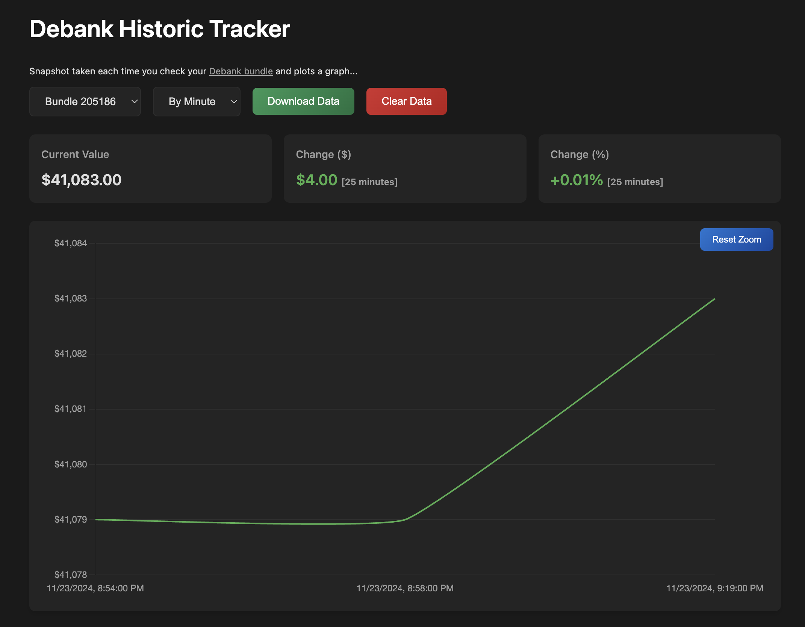

# Debank Historic Tracker

Debank Historic Tracker is a Chrome extension that takes a snapshot of your Debank bundles' total balance each time you visit the webpage and allows you to plot a graph of your portfolio over time.



## Features

- Captures the total balance of your Debank bundles each time you visit the Debank bundles page.
- Plots a graph of your portfolio's historic value over time.
- Allows you to download the historical data as a JSON file.
- Provides options to clear the stored data.

## Installation

### Clone the Repository

1. Clone this repository to your local machine using the following command:
   ```sh
   git clone https://github.com/apoorvlathey/debank-tracker.git
   ```

### Load the Extension in Chrome

1. Open Chrome and navigate to [chrome://extensions/](chrome://extensions/).
2. Enable "Developer mode" by toggling the switch in the top right corner.
3. Click on the "Load unpacked" button.
4. Select the directory where you cloned this repository.

## Usage

1. Visit a specific bundle page by heading over to [Debank bundles page](https://debank.com/bundles).
2. The extension will automatically capture the total balance and save it locally.
3. Click on the extension icon in the Chrome toolbar to open the popup.
4. Click on "View History" to see the historical data and see the historic graph.
5. Use the controls to download or clear the data as needed.

## Contributing

Contributions are welcome! Please open an issue or submit a pull request for any improvements or bug fixes.

## License

This project is licensed under the MIT License.
